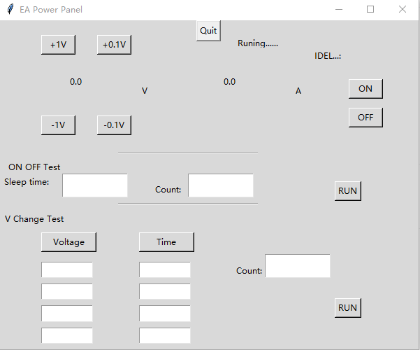

# Ugly_EA_PS2000_panel
EA PS2000 Serial control panel by Python3

## HOWTO

1. Install EA USB driver
2. `pip install ea-psu-controller`
3. `python3 ea_power_gui.py`

## Feature list

- Voltage and Current real-time display
- ON/OFF Control
- Voltage online change
- ON/OFF pressure test
- Voltage change test

## Ugly UI

 

## TODO

1. Optimize the UI
2. Optimized code
3. Support other control

